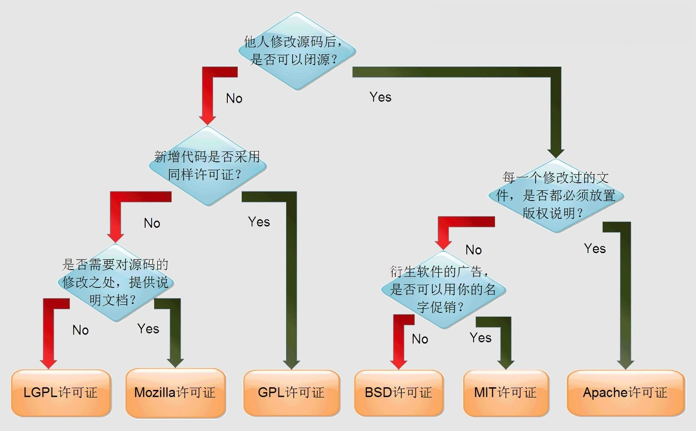
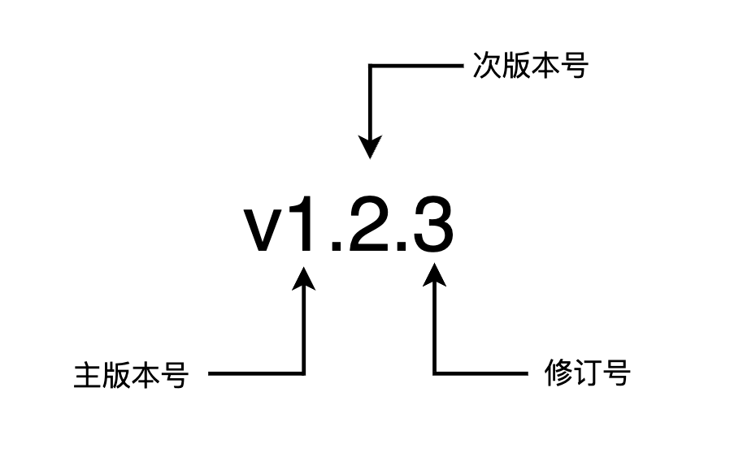

## 为什么需要规范

现在开发一个应用基本上都是多人协作，一旦涉及到多人，必然不同的开发者的开发习惯、编码方式都是有所不同的，如果没有一个统一的规范，就会造成非常多的问题：

- 代码风格不一
- 目录杂乱无章
- 接口不统一（偏后端），例如：
  - 修改用户定的接口为 /v1/users
  - 修改密钥的接口： /v1/secret?name=username
- 错误码不统一

因此，我们需要一个好的规范来约束开发者，以便保证大家开发的是“一个项目”。


## 有哪些规范

整体来讲，我根据规范是否涉及到代码，将其分为了两大类：

- 非编码类规范
  - 开源规范
  - 文档规范
  - CommitMessage规范
  - 版本规范
- 编码类规范
  - 目录规范
  - 代码规范
  - 接口规范（偏后端）
  - 日志规范
  - 错误码规范


## 开源规范

目前，其实在整个业界并没有一个官方的开源规范，但是当我们决定要将我们的代码进行开源的时候，实际上是有一些隐式的规则需要我们去遵循的。

- 较高的单元覆盖率
  - 当我们要将我们的项目进行开源的时候，那么项目肯定是经过了单元测试（Mocha、Jest、Vitest），要求单元测试的覆盖率达到一个较高的标准，例如 90%。
  - 这样不仅仅保证了你的项目的健壮性，而且非常有利于第三方开发者。
- 避免敏感信息外漏
  - 要确保整个代码库和提交记录不能出现内部 IP、密码、密钥这一类信息，否则会造成安全隐患
- 及时反馈
  - 当我们的开源项目被其他开发者提了 PR、Issue、评论的时候，一定要及时的去处理。
- 及时更新
  - 我们自身也要针对该开源项目及时的去更新功能、修复 Bug。
  - 针对一些已经结项、不维护的项目，需要及时的对项目进行归档、还要在项目描述中加以说明


另外还有一点，需要了解常见的开源协议。常见的开源协议有 MIT、Apache，具体如下表所示：

| 开源协议                                     | 特点                                                         | 适用场景                                                     |
| -------------------------------------------- | ------------------------------------------------------------ | ------------------------------------------------------------ |
| GPL（GNU General Public License）            | 它是最严格的开源协议之一。如果你使用了GPL授权的代码，那么你的项目也必须采用GPL。这意味着你必须开源自己的代码，并且任何衍生的作品也必须使用GPL。 | 对于那些希望他们的代码和衍生作品始终保持开源的项目来说，这是一个很好的选择。 |
| MPL（Mozilla Public License）                | MPL是一种温和的开源协议。它允许在同一个项目中混合使用MPL和非MPL代码，但是任何修改MPL代码的部分必须保持开源。 | 对于想要某些部分代码保持开源，同时允许与私有代码结合的项目。 |
| LGPL（Lesser General Public License）        | 比GPL宽松。如果你使用了LGPL授权的库，你的项目不需要开源，只要你对这个库所做的修改开源即可。 | 常用于库和框架，使它们能够被更广泛地应用于各种软件项目中。   |
| Apache License                               | 提供了很大的自由度，包括商业使用。你可以修改和分发代码，无需公开源代码。它还明确了对专利的授权。 | 对于那些希望代码被广泛使用，包括在商业产品中，并且希望提供一定的法律保护的项目。 |
| BSD（Berkeley Software Distribution）License | 非常宽松，几乎没有什么限制。你可以自由使用、修改和重新分发代码，甚至在商业软件中。不过该协议禁止用开源代码作者/机构名字和原来产品名字来做市场推广。 | 适用于几乎所有类型的项目，特别是那些希望代码被尽可能广泛地使用的项目。 |
| MIT License                                  | 也是一种非常宽松的许可证，和BSD类似。允许你做几乎任何你想做的事，只要在复制或分发时包含许可证原文。 | 对于那些希望简单、灵活地授权其代码的项目。                   |

> 在上表中所罗列出来的协议，从上往下，依次从严格到宽松



或者可以参考 Choose an open source license：https://choosealicense.com/

目前前端常用的协议就是 BSD、MIT、Apache

| 协议   | 项目                                        |
| ------ | ------------------------------------------- |
| MIT    | jQuery、React、Lodash、Vue、Angular、ESLint |
| BSD    | Yeoman、node-inspector                      |
| Apache | Echarts、Less.js、math.js、TypeScript       |


另外，就算你的项目不打算开源，你也应该尽量的去按照项目的开源规范去建设你的项目。开源项目一般在 <u>代码质量、文档规范、目录结构、接口等等</u>地方都要求比较高。


## 文档规范

文档也是咱们在进行软件交付的时候，一个非常重要的组成部分。

一个项目，需要编写哪些文档？这些文档又应该如何进行编写？

一个项目中比较重要的几类文档如下：

- README文档
- 待办清单
- 变更日志
- API文档（根据项目类型而定）


### README文档

README文档是其他开发者在看你项目的时候，会阅读到的第一个文档，该文档一般放置于项目的根目录下面。

README文档的好坏直接影响了其他开发者在阅读了解你项目的时候的一个阅读体验。

一个合格的 README 文档，需要包含以下三个方面：

- 项目的介绍
- 使用者指南
- 贡献者指南

下面是一份 README 文档的标准模板：

```markdown
# 项目名称
<!-- 写一段简短的话来介绍项目 -->

## 功能特性
<!-- 描述该项目的核心功能点 -->

## 软件架构（可选）
<!-- 可以描述一下项目的架构 -->

## 快速开始
### 依赖检查
<!-- 描述该项目的依赖，比如比较重要的依赖包、工具或者其他依赖项 -->
### 构建
<!-- 描述如何构建项目 -->
### 运行
<!-- 描述如何运行该项目 -->

## 使用指南
<!-- 描述如何使用该项目 -->

## 如何贡献
<!-- 告诉其他开发者如何给该项目贡献代码 -->

## 社区（可选）
<!-- 如果存在社区可以简单介绍一下社区相关内容 -->

## 关于作者
<!-- 写上简短的项目作者介绍 -->

## 谁在用（可选）
<!-- 可以列出使用该项目的其他有影响力的项目，算是给项目打一个广告 -->

## 许可证
<!-- 这里链接上该项目的开源许可证 -->
```


### 待办清单

用于记录即将要发布的内容或者未来的计划。

在我们的项目里面添加一个待办清单有两个好处：

- 告诉项目的使用者，未来会有哪些功能
- 为我们自己做一个备忘，提醒我们自己未来要交付的功能有哪些

一般就用 Markdown 来写就可以了，[x] 和 [ ] 在 Markdown 语法里面是复选框的形式，能够很好的表现待办事项

```markdown
# 计划列表
这是一个 TODO 列表，包含了 jstoolpack 未来可能添加或改进的功能。
## 数组方法
- [x] 添加一个方法，用于在数组中查找指定元素的索引值。
## 字符串方法
- [x] 完成字符串截取方法
- [ ] 检测一个字符串是否是 URL 的方法。
## 函数方法
- [x] debounce 方法
- [ ] throttle 方法
## 通用
- [ ] 添加一个方法，用于将两个数组合并为一个对象。
## 测试
- [x] 编写更多的测试用例，覆盖所有的函数和方法。
## 文档
- [x] 完善 README 文件，包括更多的使用示例和 API 文档。
- [ ] 添加一个 CONTRIBUTING 文件，包含贡献指南和代码风格规范。
## 其他
- [ ] 添加一个 CHANGELOG 文件，记录每个版本的变化。
- [ ] 增加 CI/CD 功能，包括自动化测试和持续集成。
- [ ] 发布到更多的包管理器，如 NPM 和 Yarn。
- [ ] 改进代码的性能和可读性。
- [ ] 添加更多的函数和方法，以满足不同的开发需求。
```


### 变更日志

变更日志主要是用来记录每一次变更的详细内容，添加变更日志文档有两个好处：

- 方便使用者了解版本升级所带来的变化，特别是 Breaking Change
- 也开发者自己做一个备忘

变更日志一般会记录：

- 版本号
- 变更时间
- 具体的变更内容

示例如下：

```markdown
# 变更日志
所有版本的变化都记录在这个文件中。本文件遵循 [Keep a Changelog](https://keepachangelog.com/zh-CN/1.0.0/) 标准。
## [1.0.0](https://github.com/) - 2022-01-01
### 新增
- 添加了一个 range 方法，用于生成指定范围内的数字数组。
- 添加了一个 truncate 方法，用于截断字符串并添加省略号。
- 添加了一个 debounce 方法，用于在一定时间内防止函数被重复调用。
- 添加了一个 throttle 方法，用于在一定时间内限制函数的调用次数。
### 修复
- 修复了一个在某些情况下会导致 debounce 和 throttle 方法失效的 bug。
### 改进
- 改进了代码的结构和文档。
- 改进了测试覆盖率和代码质量。

## [0.1.0](https://github.com/) - 2021-12-01
### 新增
- jstoolpack 项目的第一个版本。
- 添加了一个 range 方法，用于生成指定范围内的数字数组。
- 添加了一个 truncate 方法，用于截断字符串并添加省略号。
### 改进
- 改进了代码的结构和文档。
- 改进了测试覆盖率和代码质量。
```


### API文档

API文档取决于你的项目类型，如果你的项目是第三方库或者组件库，那么就需要提供 API 文档。

根据你代码库的功能的多少，在创建 API 文档的时候，有三种方案可选

- 功能较少，可以直接写到 README 文件里面
- 内容较多，可以单独写一个 API 的文件来介绍 API
- 数量非常非常多，需要考虑专门做一个网站来提供详细的文档
  - Vuepress、Vitepress、Docusaurus


## CommitMessage规范

在进行代码开发的时候，经常会涉及到代码的提交，这个时候就需要书写 CommitMessage。

CommitMessage 在书写的时候，也需要遵循一定的规范。关于 CommitMessage 规范，当然可以自己去制定一套，但是更加建议采用开源社区中提供的一些 CommitMesage 规范。

开源社区提供的 CommitMesage 规范很多：husky、jQuery、Angular、Ember、JSHint 这些技术都带来它们相应的 CommitMessage 规范。

今天晚上主要介绍 Angular 的提交规范：https://www.conventionalcommits.org/en/v1.0.0-beta.4/


在 Angular 规范中，CommitMessage 分为三个部分：Header、Body、Footer，具体的格式如下：

```markdown
<type>[optional scope]: <subject>
<!-- 空行 -->
[optional body]
<!-- 空行 -->
[optional footer]
```


### Header

这个部分只有一行，包括三个字段：type（必填）、scope（可选）和 subject（必填）

**type**

主要用于说明 CommitMessage 的类型，这里又分为两种类型：

- Development：这一类类型一般是项目管理类的更新，这一类更新是不会影响用户和生产环境的代码的。
  - 例如 CI 流程、构建方式等这一类修改
  - 这一类修改通常也意味着可以免测试发布
- Production：这一类修改会影响生产环境的代码
  - 因此针对这一类代码的修改，我们一定要谨慎，需要做好充分的测试

下面的表是 Angular 规范中所罗列出来的常见的类型和所属类别：

| 类型     | 类别        | 说明                                                         |
| -------- | ----------- | ------------------------------------------------------------ |
| feat     | Production  | 新增功能                                                     |
| fix      | Production  | 修复缺陷                                                     |
| pref     | Production  | 提高代码性能的变更                                           |
| style    | Development | 代码格式类的变更，例如格式化了代码，删除了空行等             |
| refactor | Production  | 其他代码类的变更，这些变更不属于 feat、fix、pref 和 style，例如简化代码、重命名变量名、删除冗余代码等 |
| test     | Development | 新增测试用例或更新现有的测试用例                             |
| ci       | Development | 持续集成和部署相关的改动，例如修改了 Jenkins、GitLab CI 等 CI 配置文件 |
| docs     | Development | 文档类的更新，包括修改用户文档、开发文档等                   |
| chore    | Development | 其他类型，例如修改了构建流程、依赖管理或者辅助工具的变动等。 |


**scope**

主要是用于指明会影响应用的哪个部分。


**subject**

一个针对这一次提交的简短的描述信息

- 简洁明了：一般来讲就是一句话
- 动词开头：描述你这一次提交做了什么事情，add、fix、update、remove


下面是一些符合上面所讲规范的示例：

修改用户界面的错误

```
fix(UI): 修复登录界面的布局问题
```

添加新的用户认证功能

```
feat(auth): 实现基于Token的认证机制
```

改进后端API的性能

```
perf(api): 优化数据库查询效率
```

修复一个错误

```
fix: 修复导航栏响应式布局问题
```

文档更新

```
docs: 更新README文件，添加部署指南
```


### Body

Header 部分是对 commit 做一个高度的概括，那么 Body 就进行更加具体的描述。

Body 的形式是比较自由，示例如下：

```
feat(login): 实现新的登录流程

为了提高用户体验和安全性，我们重新设计了登录流程。新的流程包括以下改变：

- 引入了 OAuth 2.0 认证，使用户可以通过 Google 账号登录。
- 优化了登录表单的布局，现在在移动设备上显示更为友好。
- 增加了验证码功能，以防止自动化的恶意登录尝试。

这些改变旨在使登录过程更加流畅，同时提高了账户的安全性。新的 OAuth 认证方式简化了用户的登录步骤，而对移动布局的优化则确保了在各种设备上的可用性。
```

Body 虽然说形式比较自由，但是一般会描述这么几个方面的信息：

- 描述更改的背景
- 详细罗列出具体的改变
- 解释这些改变的目的和好处


### Footer

footer 主要是两个目的。

- 一是关闭相关的 issue

```
Closes #123, #124
```

在 CommitMessage 中书写关闭了哪些 issue 的 footer 有一个好处，能够在以后 PR 的时候自动关闭这些 issue。

在 Github 这样的平台，如何 CommitMessage 中带有 Closes、Fixes 等关键字，后面有 issue 的编号，那么在之后进行 PR 合并的时候，会自动关闭相关联的 issue。

- 不兼容的变更（breaking change）

```
BREAKING CHANGE: 更改了身份验证 API 的接口结构。

旧的接口 /api/auth/login 现在变更为 /api/user/login。更新了所有的调用点以适应这一变更。如果你在你的代码中直接使用了这个接口，请更新为新的接口地址。
```


## 版本规范

目前业界比较主流的是 **<u>语义化版本规范</u>**，来自于 Github 所推出的。

整体的格式：主版本号.次版本号.修订号（ x. y .z）



- 主版本：在做了不兼容的 API 的时候会递增。
- 次版本：一般是在当前版本中做了新增功能时递增。不成文规定：偶数一般为稳定版本，奇数为开发版本。
- 修订号：针对某一个 bug 进行修复了之后递增

除了上面的表示方式，你可能还会看到：


整体的格式变为：主版本号 .次版本号 .修订号\[- 先行版本号][+ 版本编译元数据]

- 先行版本号：该版本还不稳定，最终还没有确定下来，仅仅是一个预览。

1.0.0-alpha

1.0.0-alpha.1

1.0.0-0.3.7

1.0.0-x.7.z.92

以一连串以句点分隔的标识符

- 编译版本号：在编译器编译的过程中，自动生成的。

1.0.0-alpha+001

1.0.0+2013031344700

1.0.0-beta+exp.sha.5114f85

一般以 + 号开头，后面就是编译版本号

关于语义化版本号具体规则，可以参阅：https://semver.org/lang/zh-CN/

关于最佳实践：

- 在实际开发的时候，建议使用 0.1.0 作为你的第一个开发版本号
- 当我们的版本是一个稳定的版本，并且第一次对外发布的时候，那么版本号可以定为 1.0.0
- 按照 Angular Commit Message 提交规范来看的话，版本的确定：
  - fix 类型的 commit 修订号 +1
  - feat 类型的 commit 次版本号 +1
  - 带有 Breaking Change 的 commit 可以主版本号 +1


## 编码类规范

### 1. 代码规范

- 阿里：https://github.com/alibaba/f2e-spec?tab=readme-ov-file
- 腾讯：https://imweb.github.io/rule/

上面的规范，虽然很有名，但是也算是内部规范。在整个业界，讨论得比较多的是 Airbnb 和 Google 所推出规范。


**Airbnb**

1. **可读性和一致性**：风格指南强调代码的可读性和一致性。它包含了关于空格、缩进、换行、命名约定等的详细规则，以确保代码的整洁和一致性。
2. **ES6 和更新的语法**：指南特别关注于使用最新的 JavaScript 特性，比如 ES6（ECMAScript 2015）及以后版本的语法，包括箭头函数、模板字符串、解构赋值等。
3. **最佳实践**：它还包括了许多编程最佳实践，比如避免使用 `var` 声明变量，优先使用 `const` 和 `let`，以及如何编写模块化和可重用的代码。
4. **代码组织**：指南还涵盖了有关代码结构和组织的建议，比如文件结构、模块导入等。
5. **易于集成**：Airbnb 的 JavaScript 风格指南可以很容易地与代码质量工具（如 ESLint、Prettier）集成，以自动检查和格式化代码，确保遵守规范。

官网：https://github.com/airbnb/javascript


**Google**

Google 推出的代码规范叫做 Google JavaScript Style Guide

官网：https://google.github.io/styleguide/jsguide.html


除了上面介绍的两套规范以外，我们开发的时候，还有两个常用的工具：

- ESLint：ESLint 本身并非一个编程风格的指南，是一个 JS 代码质量和风格的检查工具。
- Prettier：该工具主要是负责做格式化，它是属于  opinionated 类型的工具，与之对应的是 unopinionated

>opinionated :内部已经内置了一套最佳实践，要求你按照它的方式走，不要想东想西的。
>
>spring boot、Ruby on Rails、thinkPHP、Angular
>
>unopinionated：特点就是允许用户 DIY，提供了一定的灵活性和自定义性
>
>express


**关于 ESLint 和 Prettier 之间的冲突问题**

在 google 规范中，推荐字符串使用单引号，以分号结束语句。

prettier 设置的是格式化规则为双引号，不要分号。

因此产生冲突。

- eslint-config-prettier：关闭所有 prettier 和 eslint 工具中会发生冲突的规则。
- eslint-plugin-prettier：该插件的作用是将 prettier 的格式化规则作为 ESLint 规则来进行检查。


**Vue代码规范**

实际上在 Vue 官网是提供了代码指南的。

官网：https://vuejs.org/style-guide/


### 2. 目录规范

下面给出一个常见的项目目录示例（以 Vue 项目为例）

```
📁my-app
  |-- 📁src
  |   |-- 📁assets          # 静态资源（图片、样式表、字体等）
  |   |-- 📁components      # 可重用的 UI 组件
  |   |-- 📁views           # 页面级组件（或称为“容器”组件）
  |   |-- 📁layouts         # 应用布局组件
  |   |-- 📁router          # 路由配置（对于 SPA 类型的应用）
  |   |-- 📁store           # 状态管理（例如 Vuex/Redux 的相关代码）
  |   |-- 📁services        # 服务（例如 API 交互）
  |   |-- 📁utils           # 实用工具函数和助手
  |   |-- 📃App.vue          # 根 Vue 组件（对于 Vue 应用）
  |   |-- 📃main.js          # 应用的主入口文件
  |-- 📁public
  |   |-- 📃index.html       # 主 HTML 文件
  |   |-- 📃favicon.ico      # 网站图标
  |-- 📁tests
  |   |-- 📁unit            # 单元测试
  |   |-- 📁e2e             # 端到端测试
  |-- /node_modules        # 项目依赖文件夹
  |-- 📃package.json         # 项目的依赖、脚本和配置
  |-- 📃README.md            # 项目的 README 文件
  |-- 📃.gitignore           # Git 忽略文件配置
  |-- 📃.eslintrc.js         # ESLint 配置
  |-- 📃.prettierrc.js       # Prettier 配置
  # 其他可能的配置或文件
  |-- 📃.browserslistrc      # 浏览器兼容性配置
  |-- 📃.env                 # 环境变量配置
  |-- 📁config              # 项目配置文件
  |-- 📁dist                # 构建后的输出目录
  |-- 📁docs                # 项目文档
  |-- 📁.vscode             # VS Code 配置
```

如果是 monorepo 方式的项目，目录又会有一些不同：

假设是使用 pnpm + workspace 来搭建的 monorepo

```
📁my-monorepo-app
  |-- 📁packages
  |   |-- 📁package1           # 子项目 1
  |   |   |-- 📁src
  |   |   |-- 📃package.json
  |   |-- 📁package2           # 子项目 2
  |   |   |-- 📁src
  |   |   |-- 📃package.json
  |   |-- 📁shared             # 共享代码或组件
  |       |-- 📁src
  |       |-- 📃package.json
  |-- 📃package.json            # Monorepo 根级别的 package.json
  |-- 📃pnpm-workspace.yaml     # pnpm 工作区配置文件
  |-- 📃pnpm-lock.yaml          # pnpm 锁文件
  |-- 📃README.md
  |-- 📃.gitignore
  |-- 📃.eslintrc.js            # ESLint 配置
  |-- 📃.prettierrc.js          # Prettier 配置
  # 其他配置文件
```

- 包：只要使用包管理工具（npm、yarn、pnpm）初始化后了的目录，就是一个包
- 库：只要使用版本控制工具初始化后的目录，就是一个库

- monorepo：一个仓库里面多个包

>好处：提取公共值
>
>- 公共的 ESlint、prettier 的配置
>- 公共的依赖
>- 公共的构建流程

- multirepo：一个包就对应一个仓库


### 3. 测试的规范

常见的测试：

- 单元测试：测试一个应用里面的最小单元（函数、组件），常见的测试框架 Jest、Mocha、Vitest
- 集成测试
- E2E测试
- 视觉回归测试

**1. 测试的独立性**

每个测试案例都应该独立于其他测试，不依赖其他测试的状态或者结果。

避免使用共享的数据或者状态

Good Case

```js
describe('Calculator tests', () => {
  it('should add two numbers', () => {
    expect(add(2, 3)).toBe(5);
  });

  it('should subtract two numbers', () => {
    expect(subtract(5, 2)).toBe(3);
  });
});
```

Bad Case

```js
let result = 0;

describe('Calculator tests with shared state', () => {
  it('should add two numbers', () => {
    result = add(2, 3);
    expect(result).toBe(5);
  });

  it('should subtract two numbers based on previous result', () => {
    result = subtract(result, 2); // 依赖上一个测试的结果
    expect(result).toBe(3);
  });
});
```


**2. 测试命名**

测试用例的命名应该是清晰的描述了该测试用例的目的和行为。

Good Case

```js
describe('User authentication', () => {
  it('should log in with valid credentials', () => {
    // ...
  });

  it('should reject login with invalid credentials', () => {
    // ...
  });
});
```

Bad Case

```js
describe('User login', () => {
  test('test1', () => {
    // ... 无描述性命名
  });

  test('test2', () => {
    // ... 无描述性命名
  });
});
```


**3. 边界测试**

在测试的时候，特别针对于函数，需要测试边界以及一些特殊情况（空输入、非法参数），并且每个测试用例只测试一个行为或者一个功能点。

Good Case

```js
describe('String reverser', () => {
  it('should reverse a non-empty string', () => {
    expect(reverseString('hello')).toBe('olleh');
  });

  it('should handle an empty string', () => {
    expect(reverseString('')).toBe('');
  });
});
```

Bad Case

```js
describe('String reverser', () => {
  it('should reverse strings and handle empty string', () => {
    expect(reverseString('hello')).toBe('olleh');
    expect(reverseString('')).toBe(''); // 混合了两个测试案例
  });
});
```


**4. 依赖隔离**

因为我们是单元测试，单元测试强调的是要和外部隔离，如果要测试的单元涉及到外部的连接（发送请求、访问数据库），使用 mock 进行模拟，屏蔽掉外部的影响

Good Case

```js
it('should send user data', () => {
  const mockApi = jest.fn();
  sendUserData({ id: 1, name: 'John' }, mockApi);
  expect(mockApi).toHaveBeenCalledWith({ id: 1, name: 'John' });
});
```

Bad Case

```js
it('should send user data', () => {
  sendUserData({ id: 1, name: 'John' }, realApiCall); // 使用真实API
  // ... 测试依赖外部API的响应
});
```


**5. 测试反馈**

使用清晰的断言来提供反馈信息

Good Case

```js
it('should fail to withdraw with insufficient balance', () => {
  expect(() => withdraw(account, 100)).toThrow('Insufficient balance');
});
```

Bad Case

```js
it('should fail to withdraw', () => {
  expect(() => withdraw(account, 100)).toThrow(); // 缺少具体的错误信息验证
});
```

